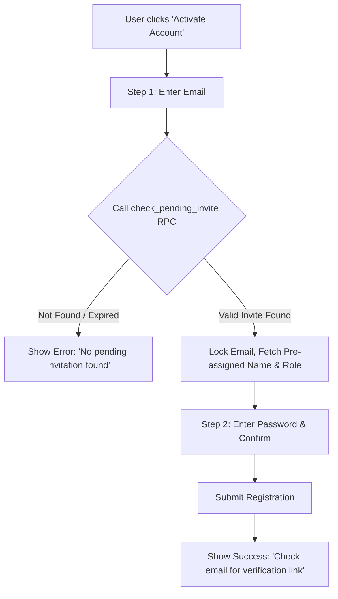

# Implementation Plan: Invite-Only Account Activation Flow

In the original configuration, any user could register an account directly on the open "Create Account" tab. Since application onboarding is designed around an **invite-first model** (where administrators create user invitations and pre-assign roles in the `invites` table), open signup was insecure and did not match the business flow.

This plan documents the transition of the signup page into a secure **"Account Activation"** flow.

---

## Technical Details & Architecture



---

## Proposed Changes

### Database Layer (Supabase)

#### RPC Function `check_pending_invite`
Allows the frontend to securely verify if a pending invitation exists for an email address without exposing the full database table:
```sql
create or replace function public.check_pending_invite(email_to_check text)
returns json
language plpgsql
security definer
as $$
declare
  invite_record record;
begin
  select name, role, status, expires_at
  into invite_record
  from public.invites
  where lower(email) = lower(trim(email_to_check))
    and status = 'Pending'
    and (expires_at is null or expires_at > now())
  order by created_at desc
  limit 1;

  if invite_record is null then
    if lower(trim(email_to_check)) = 'johnkingunwanao@gmail.com' then
      return json_build_object('exists', true, 'name', 'Superadmin User', 'role', 'Superadmin');
    end if;
    return json_build_object('exists', false);
  else
    return json_build_object('exists', true, 'name', coalesce(invite_record.name, ''), 'role', invite_record.role);
  end if;
end;
$$;
```

#### Trigger `handle_new_user` Server-Side Enforcement
Updated to fail user signup if no valid invitation exists (preventing direct API registration bypass):
```sql
  if invited_role is null then
    raise exception 'Access Denied: Email % has not been invited to this workspace.', new.email;
  end if;
```

---

### Frontend Layer (React)
* **Tab Rebranding:** Renamed tab title and headers from "Create Account" to **"Activate Account"**.
* **Two-Step Verification:**
  * **Step 1:** Only shows Email input and a **"Verify Invitation"** action.
  * **Step 2:** Locks the Email field, displays the pre-assigned role, and prompts the user to select and confirm their password.
